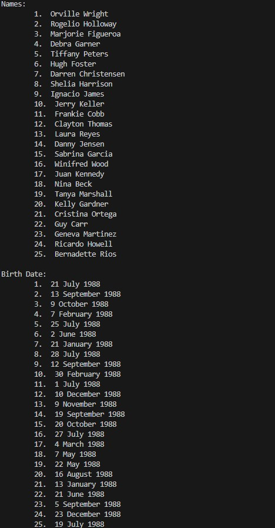

# IO - Operations Input/Output
Programs designed to show how we can read information from a file on your computer and write that information to another
file.
## Description
### Input
We create a program that reads data from the provided text file (DOB.txt) and prints it out in two different sections
in the format shown below:

### Output
For this we create a progam that allows a user to register students for an exam venue.
- first we ask how many students are registering.
- we create a loop that runs for that number of students.
- Each time the loop runs the program asks the user to enter the next student ID.
- Each ID is written to a text file (reg_form.txt)
- we include a dotted line after each student ID for students to sign on.

## Project Useage 
This repository exists as part of my Technical Portfolio with HyperionDev Software Engineering Bootcamp.
It also serves for potential employers to showcase my ability to work with input and output operations using python.
